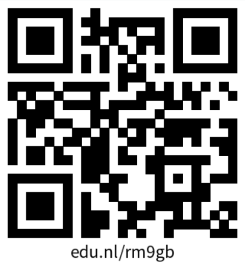

# Squad page

Ontwerp en maak met een team een Squad Page met HTML, CSS en JS.

<!--De instructie van deze leertaak staan in de [INSTRUCTIONS](https://github.com/fdnd-task/your-tribe-squad-page/blob/main/docs/INSTRUCTIONS.md)-->
De instructie voor deze leertaak staan in de [WIKI](https://github.com/fdnd-task/your-tribe-squad-page/wiki)
## Inhoudsopgave

## Beschrijving
Wij hebben de opdracht gekregen om een Squad page te maken waarin wij
alle visitekaartjes van de Squad verwerken, 
een aantal plekken op de Amstelcampus uitlichten
en wij hebben een aantal andere elementen uit de lessen in onze page verwerkt.
Wij drieën hebben elk een eigen pagina gemaakt waar wij elk mee bezig zijn geweest.
De één is er iets verder mee gekomen dan de ander, desalniettemin willen wij deze alsnog laten zien.

## Gebruik
Op de pagina staat een duidelijke  header met navigatie, titel,  slogan en een zoekbalk. Via de navigatie kun je navigeren naar squad, explore en contact. Daarnaast kun je via de zoekbalk op zoek naar het visitekaartje van een squad member. Verder is het onderaan de pagina ook mogelijk om door de visitekaartjes heen te scrollen.

Squad: via Squad kun je de verschillende visitekaartjes van de squad bekijken.
Explore: via Explore kun je interessante plekken op de Amstelcampus bekijken.
Contact: via Contact kun je onze contactgegevens bekijken. 
### Link-pagina

Hier is een link naar [De squad-page van Team123](https://edu.nl/rm9gb).


## Amstelcampus
Voor dit onderdeel is er onderzocht welke plekken er op de Amstelcampus het bezoeken waard zijn.
Deze locaties zijn onderverdeeld in twee categorieën:
Studeerplekken
Vrije tijd

Studeren

De Balkons in het Jacoba Mulderhuis.
Dit zijn open ruimtes waar je in je eentje of samen kan gaan studeren. Je zit als het ware op een hoger balkon dat uitkijkt op een soort pleintje beneden. 
Wij als Frontenders kijken hierop uit als wij door het raam kijken.

Bibliotheek in het Kohnstammhuis op de eerste etage.
Dit is een ruimte waar je kan gaan zitten als je behoefte hebt om in stilte te gaan studeren. 
Via deze link: Kohnstammhuis Stilteruimte 1e etage (148 plekken) kan je de livebezetting in de gaten houden.

Projectruimtes WIbauthuis op de eerste en tweede etage.
Hier heb je een privéruimte waar je niet gestoord wordt.
Indien de ruimtes vrij zijn, zijn ze vrij te gebruiken voor studenten die in groepsverband opdrachten moeten maken. Je moet wel geluk hebben dat er eentje vrij is, deze zijn namelijk niet te reserveren.

Vrije tijd

Café Fest op het Wibauthof.
Dit is een chill cafétje waar je binnen kan studeren onder het genot van een drankje of met lekker weer, buiten met studiegenoten kan naborrelen. Voor elk moment van de dag kan je hier terecht.

Het dakterras van het Muller-Lulofshuis op de tweede etage.
Dit dakterras is beschut en kan je naartoe als je ergens in de buitenlucht in rust wilt zitten. Of je nu met je studiegenoten wilt zitten of even een frisse neus wilt halen. Dat kan hier!

Het culturele platform FLOOR (evenementen op de begane grond van WIbautstraat 3b)
FLoor is een cultureel platform die elke week evenementen organiseert over oneindige onderwerpen, voor ieder wat wils. Van een Workshop voor het maken van een mini-ecosysteem tot panelgesprekken over ADHD en luisterevenementen. Elke student van elke studie kan zich hier voor aanmelden.


## Kenmerken
Onze site is gebouwd met HTML en CSS. Op sommige pagina’s is er ook JavaScript gebruikt.
### HTML
Over het algemeen hebben wij dezelfde HTML indeling gebruikt. Zoals het gebruik van buttons, links en een zoek-kopje. Hierbij horen ook de icoontjes van de pagina’s.
#### Header
In de header staat de navigatie met de knoppen. home, squad, explore en contact.  Daarnaast staat in de header de titel van de pagina ‘THE SQUAD’ , de slogan en de zoekbalk.  Met de zoekbalk. kun je een specifiek squad member opzoeken. 

#### Main
In de main staan alle visitekaartjes van de squad met de bijbehorende pijltjes om door de visitekaartjes heen te kunnen scrollen. de visitekaartjes staan als afbeelding in de main. 


### CSS
Met de CSS hebben we de website vormgegeven. We hebben gebruik gemaakt van verschillende kleuren, achtergronden en lettertype. Hieronder valt ook de header. Hierbij zijn er verschillende kleuren/IMG, groottes en lettertype gebruikt. In de CSS staat:

`background-image: url("gradient_paars.jpg"); `dit stukje voegt de afbeelding toe als achtergrond. 
 `background-size: cover;`staat op cover en zorgt ervoor dat de afbeelding de gehele header bedekt. 
 


`background: rgba(255, 255, 255, 0.2);` geeft de extra laag een witte kleur. De 0.2 staat voor 20% dekking, waardoor de achtergrondafbeelding lichter en transparanter lijkt. 


`font-size: 70px;`
de font size bepaalt de grootte van de titel, deze staat op 70px.
`text-shadow: 0px 0px 12px rgb(255, 255, 255);
`zorgt voor een gloed rondom de titel, in dit geval is het een witte gloed. 

.search 
`display: flex;`
maakt van de .search een flex-container.

`justify-content: center;`
zorgt voor de juiste positie van de zoekbalk, hier staat hij ingesteld op horizontaal in het midden. 


#### Responsive gedrag
De pagina van Joost reageert op verschillende schermbreedtes.
Bij de smalle weergave is de navigatie onderaan en zijn de pijlen om
naar een ander visitekaartje te gaan boven het visitekaartje.
Is het scherm breder, dan komt de navigatie aan de linkerkant en bevat
die niet alleen icoontjes, maar ook woorden. Vanaf een bepaalde breedte
verschijnen de pijlknoppen aan de zijkanten van de visitekaartjes.

.

.

Het gedrag van de pijlknoppen is gedaan met een container-query.
Het had ook met een media-query gekund, maar dit was wel een mooie oefening. 
De `<section>`-elementen hebben `container-type: inline-size;` zodat je vanaf een
bepaalde breedte van de `<section>`, andere styles kan activeren.
```
    @container (width > 30rem) {
        grid-template-columns: [links zoek] max-content [kaarten] 1fr [kaarten-einde rechts] max-content [zoek-einde];
        grid-template-rows: [links rechts kaarten] 1fr [zoek] min-content;
    }
```
## Bronnen
 Dit zijn de bronnen voor het onderzoek naar de Amstelcampus en de leuke plekken.

De Balkons in het Jacoba Mulderhuis.
Hier zie je een plattegrond/indeling van de bibliotheek waar je kan studeren en hoe alles staat ingedeeld.
 Jakoba Mulderhuis HvA Amsterdam - EX interiors

Bibliotheek in het Kohnstammhuis op de eerste etage.
Hier zie je openingstijden en meer informatie dat relevant is voor je bezoek aan deze bibliotheek.
Kohnstammhuis (Bibliotheek) | HvA

Projectruimtes WIbauthuis op de eerste en tweede etage.
Hier vind je aanvullende informatie over je bezoek aan een projectruimte.
Wibauthuis | Bibliotheek | Locaties | HvA

Café Fest op het Wibauthof.
In de link hieronder kom je op de website van het Café. hier vind je onder anderen de menukaart.
Café Fest | de huiskamer van de Amstelcampus

Het dakterras van het Muller-Lulofshuis op de tweede etage.
De link verwijst je naar een Youtube video die een virtual tour geeft met het dakterras erin.
Virtual tour - Muller-Lulofshuis - Hogeschool van Amsterdam (360-graden VR video)

Het culturele platform FLOOR (evenementen op de begane grond van WIbautstraat 3b)
Dit is de contactpagina van het platform op de HvA-website:  Contact | FLOOR | HvA
En de tweede link is een verwijzing naar het Instagram account van de organisatie. Hier delen zij foto’s en updates over het programma: (1) Instagram


## Licentie

This project is licensed under the terms of the [MIT license](./LICENSE).
