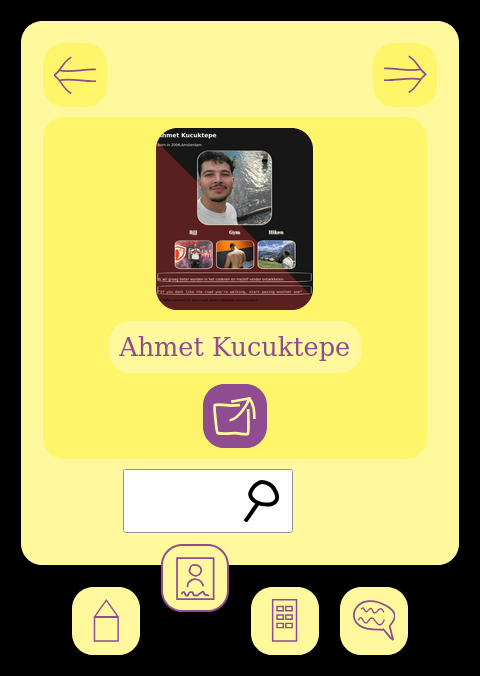
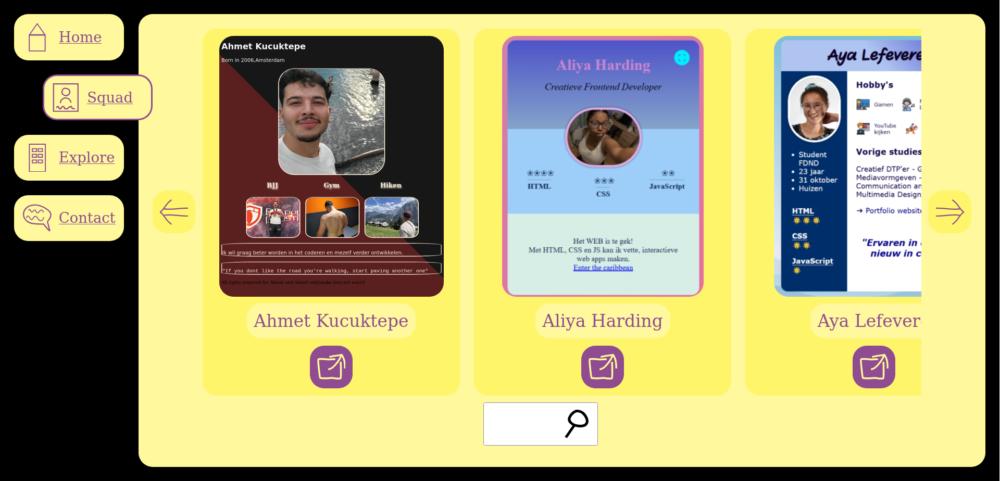

# Squad page

Ontwerp en maak met een team een Squad Page met HTML, CSS en JS.

<!--De instructie van deze leertaak staan in de [INSTRUCTIONS](https://github.com/fdnd-task/your-tribe-squad-page/blob/main/docs/INSTRUCTIONS.md)-->
De instructie voor deze leertaak staan in de [WIKI](https://github.com/fdnd-task/your-tribe-squad-page/wiki)

### CSS


#### Responsive gedrag
De pagina van Joost reageert op verschillende schermbreedtes.
Bij de smalle weergave is de navigatie onderaan en zijn de pijlen om
naar een ander visitekaartje te gaan boven het visitekaartje.
Is het scherm breder, dan komt de navigatie aan de linkerkant en bevat
die niet alleen icoontjes, maar ook woorden. Vanaf een bepaalde breedte
verschijnen de pijlknoppen aan de zijkanten van de visitekaartjes.

.

.

Het gedrag van de pijlknoppen is gedaan met een container-query.
Het had ook met een media-query gekund, maar dit was wel een mooie oefening. 
De `<section>`-elementen hebben `container-type: inline-size;` zodat je vanaf een
bepaalde breedte van de `<section>`, andere styles kan activeren.
```
    @container (width > 30rem) {
        grid-template-columns: [links zoek] max-content [kaarten] 1fr [kaarten-einde rechts] max-content [zoek-einde];
        grid-template-rows: [links rechts kaarten] 1fr [zoek] min-content;
    }
```
 


## Licentie

This project is licensed under the terms of the [MIT license](./LICENSE).
